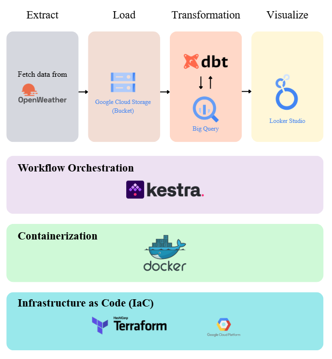
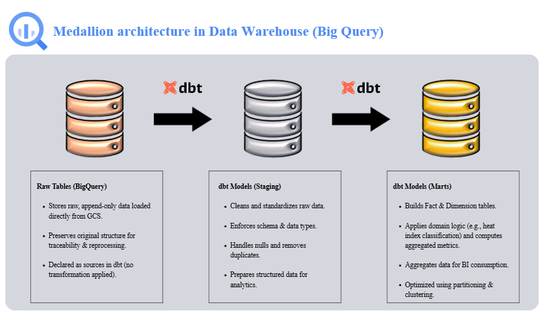

# end-to-end-weather-analytics

## 📌 Problem Statement

Weather conditions in Southeast Asia change rapidly and influence transportation, logistics, and operational decision-making. However, public weather APIs typically return semi-structured JSON data that is not analytics-ready.

Organizations need a scalable and reproducible data pipeline that can:

- Automatically collect near real-time weather data  
- Preserve raw data for traceability and reprocessing  
- Transform semi-structured data into structured, analytics-ready tables  
- Support efficient querying for dashboards and reporting  

This project addresses these challenges by designing a modern, cloud-native ELT pipeline on Google Cloud Platform.

---

## 🛠 Tech Stack

- **Orchestration:** Kestra  
- **Containerization:** Docker & Docker Compose (local development & service orchestration)  
- **Cloud:** Google Cloud Platform (GCS, BigQuery)  
- **Transformation:** dbt (BigQuery adapter)  
- **Infrastructure as Code:** Terraform  
- **Visualization:** Looker Studio  

## 🏗 Project Architecture

This project implements an end-to-end data engineering pipeline orchestrated by **Kestra** and deployed on **Google Cloud Platform (GCP)**.

## 🏗 Infrastructure as Code

All resources (GCS buckets, BigQuery datasets, service accounts) are provisioned using **Terraform**, ensuring:

- Full reproducibility  
- Version-controlled infrastructure  
- Consistent environments  

---

### 🔄 Workflow Orchestration (Kestra)

Kestra schedules and manages all workflows:

- **Every 5 minutes**
  - Triggers `Kestra/flows/02_ingest_openweather_to_gcs_bq.yaml`
  - Calls the OpenWeather API  
  - Stores raw JSON data in Google Cloud Storage (GCS)  
  - Loads data into BigQuery Bronze tables  

- **Every hour**
  - Triggers `Kestra/flows/03_dbt_build_hourly.yaml`  
  - Updates Silver (staging) and Gold (marts) layers  

---

## 🏅 Medallion Architecture (Bronze–Silver–Gold)

The project follows the **Medallion Architecture** and modern **ELT principles**, where transformations are executed inside BigQuery using dbt.

## 📊 Visualization

**Looker Studio** connects to Gold tables in BigQuery to provide dashboards showing:

- Lastest weather conditions  
- Heat risk levels  
- Hourly temperature trends  

---

## 🏗 Infrastructure as Code

All resources (GCS buckets, BigQuery datasets, service accounts) are provisioned using **Terraform**, ensuring:

- Full reproducibility  
- Version-controlled infrastructure  
- Consistent environments  

---
