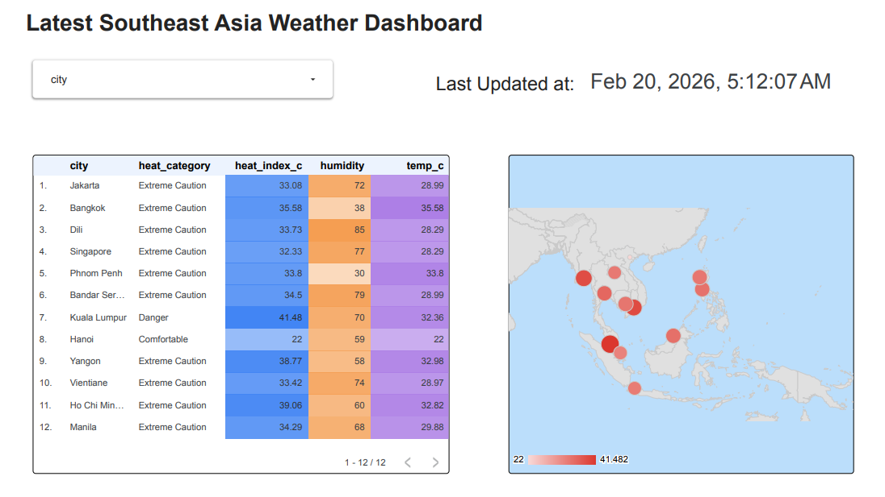
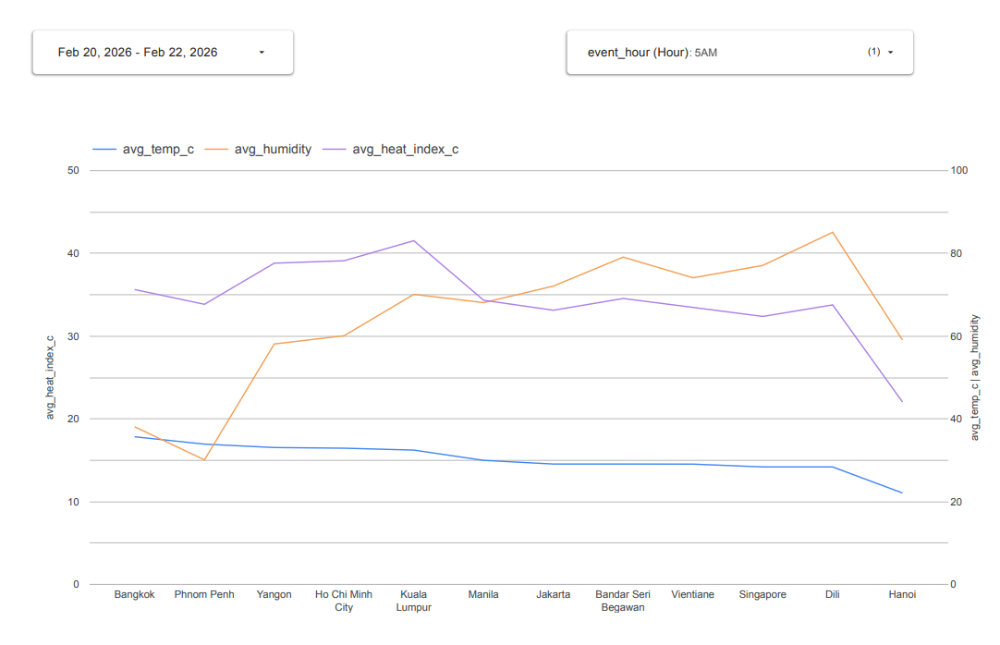
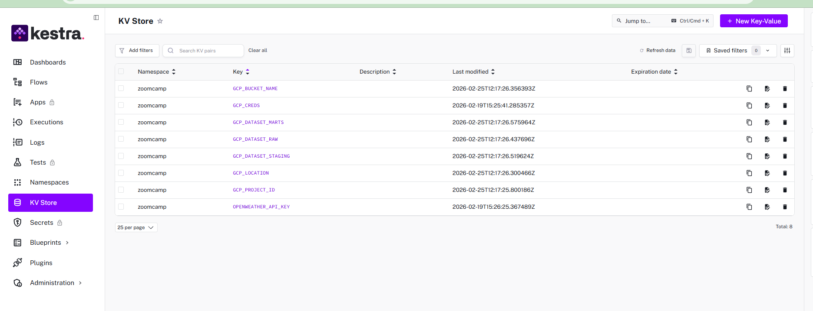
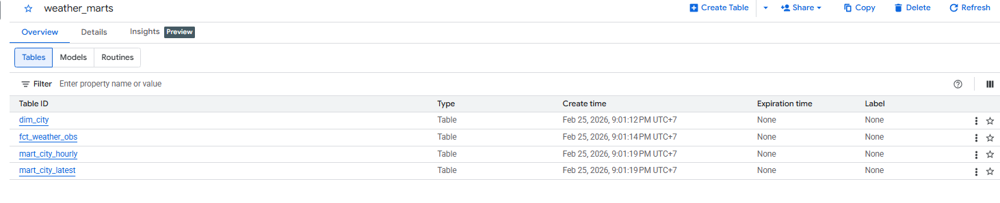

# end-to-end-weather-analytics

## 📑 Table of Contents
- [Problem Statement](#-problem-statement)
- [Tech Stack](#-tech-stack)
- [Project Architecture](#-project-architecture)
- [Project Structure](#-project-structure)
- [Infrastructure as Code](#-infrastructure-as-code)
- [Workflow Orchestration (Kestra)](#-workflow-orchestration-kestra)
- [Medallion Architecture](#-medallion-architecture-bronzesilvergold)
  * [Partition Strategy](#partition-strategy)
  * [Clustering Strategy](#clustering-strategy)
- [Visualization](#-visualization)
- [Steps to reproduce](#-steps-to-reproduce)
  * [Prerequisites](#prerequisites)
  * [Project Preparation](#1-project-preparation)
  * [GCP Setup](#2-gcp-setup)
  * [Terraform Deployment](#3-terraform-deployment)
  * [Start Kestra](#4-start-kestra)
  * [Ingestion & Transformation Data](#5-ingestion--transformation-data)
  * [Visualization](#6-visualization)
- [Future Improvements](#-future-improvements)

## 📌 Problem Statement

Weather conditions in Southeast Asia change rapidly and influence transportation, logistics, and operational decision-making. However, public weather APIs typically return semi-structured JSON data that is not analytics-ready.

Organizations need a scalable and reproducible data pipeline that can:

- Automatically collect near real-time weather data  
- Preserve raw data for traceability and reprocessing  
- Transform semi-structured data into structured, analytics-ready tables  
- Support efficient querying for dashboards and reporting  

This project addresses these challenges by designing a modern, cloud-native ELT pipeline on Google Cloud Platform.

---

## 🛠 Tech Stack

- **Orchestration:** Kestra  
- **Containerization:** Docker & Docker Compose.
- **Cloud:** Google Cloud Platform (GCS, BigQuery)  
- **Transformation:** dbt
- **Infrastructure as Code:** Terraform  
- **Visualization:** Looker Studio  

## 🏗 Project Architecture


This project implements an end-to-end data engineering pipeline orchestrated by **Kestra** and deployed on **Google Cloud Platform (GCP)**.

## 📂 Project Structure

```text
end-to-end-weather-analytics/
│
├── Kestra/
│ └── flows/
│ ├── 01_gcp_kv.yaml # GCP secrets / configuration
│ ├── 02_ingest_openweather.yaml # Ingestion flow (5-minute schedule)
│ └── 03_dbt_build_hourly.yaml # Hourly dbt transformation flow
│
├── dbt/
│ ├── models/
│ │ ├── staging/ # Silver layer models
│ │ └── marts/ # Gold layer models
│ │
│ ├── macros/ # Custom dbt macros
│ ├── tests/ # Data quality tests
│ ├── profiles/ # dbt profile configuration
│ ├── dbt_project.yml
│ ├── packages.yml
│ └── requirements.txt
│
├── terraform/
│ ├── main.tf # Core infrastructure resources
│ ├── variables.tf # Variable definitions
│ ├── outputs.tf # Terraform outputs
│ ├── versions.tf # Provider & Terraform versions
│ └── terraform.tfvars.example # Example environment config
│
├── gcp/
│ └── key.json.example # Example service account file
│
├── images/ # Architecture diagrams and screenshots 
├── test_connection/ # Local connection tests
│
├── docker-compose.yml # Local service orchestration
├── README.md
├── LICENSE
└── .gitignore 
```

## 🏗 Infrastructure as Code

All resources (GCS buckets, BigQuery datasets, service accounts) are provisioned using **Terraform**, ensuring:

- Full reproducibility  
- Version-controlled infrastructure  
- Consistent environments  

---

### 🔄 Workflow Orchestration (Kestra)

Kestra schedules and manages all workflows:

- **Every 5 minutes**
  - Triggers [02_ingest_openweather_to_gcs_bq.yaml](./Kestra/flows/02_ingest_openweather_to_gcs_bq.yaml)
  - Calls the OpenWeather API  
  - Stores raw JSON data in Google Cloud Storage (GCS)  
  - Loads data into BigQuery Bronze tables  

- **Every hour**
  - Triggers [03_dbt_build_hourly.yaml](./Kestra/flows/03_dbt_build_hourly.yaml)  
  - Updates Silver (staging) and Gold (marts) layers  

---

## 🏅 Medallion Architecture (Bronze–Silver–Gold)


The project follows the **Medallion Architecture** and modern **ELT principles**, where transformations are executed inside BigQuery using dbt.

### Partition Strategy

Fact and mart tables are **partitioned by event_hour (hour-level timestamp).**

Most analytical queries focus on:

* Last 1 hour
* Last 24 hours
* Last 7 days
* Hourly aggregations

Partitioning by event_hour allows **partition pruning**, meaning BigQuery scans only the relevant hourly partitions instead of the entire table. This significantly reduces scan cost and improves query performance for time-range analytics.

### Clustering Strategy

Tables are clustered by country, city because most queries filter or group by location.
Clustering enables block pruning within each partition, further reducing scanned data.

## 📊 Visualization

**Looker Studio** connects to Gold tables in BigQuery to provide dashboards showing:

- Lastest weather conditions  
- Heat risk levels  
- Hourly temperature trends  

### Lastest weather conditions dashboard:


### Historical weather conditions dashboard:

---


# Steps to reproduce

## Prerequisites
* Google Cloud Platform account
* Terraform installed
* Google Cloud SDK installed
* Docker and Docker Compose installed
* Git installed
* Open Weather API key

### 1. Project Preparation
**Clone the Project Repository**


```bash
git clone https://github.com/DPlayerGod/end-to-end-weather-analytics.git

cd end-to-end-weather-analytics
```

### 2. GCP Setup
You can refer to this link: [Installation Reference - DataTalks Club](https://github.com/DataTalksClub/data-engineering-zoomcamp/blob/main/01-docker-terraform/terraform/2_gcp_overview.md)

### 3. Terraform Deployment
**Initialize Terraform**
```bash
terraform init
```

Purpose: Initializes the Terraform working directory, downloads necessary provider plugins, and prepares the environment for deployment.

**Apply Terraform Configuration**
```bash
terraform apply
```

Purpose: Provisions all defined infrastructure resources on Google Cloud Platform, including GCS buckets, BigQuery datasets, and service accounts.

After running this command, Terraform will display a summary of the resources to be created. Review the changes and confirm by typing `yes` when prompted.

Finally, You can see a bucket and 3 datasets(raw, staging, marts) created in your GCP console.

### 4. Start Kestra

* Step 1: Start Kestra using Docker Compose
  ```bash
  docker-compose up -d
  ```
* Step 2: Access Kestra UI (http://localhost:8080/) (username & password are provided in the [`docker-compose.yml`](./docker-compose.yml) file)

* Step 3: Executing [01_gcp_kv.yaml](./Kestra/flows/01_gcp_kv.yaml) to set up variables (such as 	
GCP_BUCKET_NAME, 	
GCP_PROJECT_ID,.. ) in Kestra.

  **Note:** You can add flows using manual in Kestra UI or using CLI command. For example, to add [02_ingest_openweather_to_gcs_bq.yaml](./Kestra/flows/02_ingest_openweather_to_gcs_bq.yaml) flow, you can run:
  ```bash
  curl -X POST -u "admin@kestra.io:Admin1234!" http://localhost:8080/api/v1/flows/import -F fileUpload=@Kestra/flows/02_ingest_openweather_to_gcs_bq.yaml
  ```
 * Step 4: Configure Required Secrets in KV Store

    Manually add the following sensitive values in Kestra KV Store:

    * OpenWeather API Key

    * GCP Service Account Credential JSON

**Finally, 
We have the following variables:**


### 5. Ingestion & Transformation Data
Similar, after We add [02_ingest_openweather_to_gcs_bq.yaml](./Kestra/flows/02_ingest_openweather_to_gcs_bq.yaml)
and [03_dbt_build_hourly.yaml](./Kestra/flows/03_dbt_build_hourly.yaml), we will trigger them. 

Finally, we can see the data in BigQuery:



### 6. Visualization
Connect Looker Studio to the Gold tables in BigQuery and create dashboards to visualize the latest weather conditions, heat risk levels, and hourly temperature trends.

## 🚀 Future Improvements

* Implement Kafka + Spark Structured Streaming to support high-volume, near real-time data ingestion and processing.

* Reduce small file issues by aggregating streaming data into fixed time windows (e.g., 15 minutes) before landing to GCS.

* Add CI/CD pipeline (GitHub Actions) to automate dbt testing, builds, and deployment.

* Build fact and dimension tables incrementally instead of full refresh to optimize cost and performance.

* Improve data quality checks with dbt tests and freshness monitoring.

* Enhance observability with logging, monitoring, and SLA tracking.